[](https://github.com/dieter-medium/bidi2pdf-rails/blob/main/.github/workflows/ruby.yml)
[](https://codeclimate.com/github/dieter-medium/bidi2pdf-rails/maintainability)
[](https://codeclimate.com/github/dieter-medium/bidi2pdf-rails/test_coverage)
[](https://badge.fury.io/rb/bidi2pdf-rails)
[](https://www.codetriage.com/dieter-medium/bidi2pdf-rails)

# 📄 Bidi2pdfRails

**Bidi2pdfRails** is the official Rails integration for [Bidi2pdf](https://github.com/dieter-medium/bidi2pdf) — a
modern, headless-browser-based PDF rendering engine.  
Generate high-fidelity PDFs directly from your Rails views or external URLs with minimal setup.

---

## ✨ Features

- 🔍 Accurate PDF rendering using a real browser engine
- 💾 Supports both HTML string rendering and remote URL conversion
- 🔐 Built-in support for authentication (Basic Auth, cookies, headers)
- 🧰 Full test suite with examples for Rails controller integration
- 🧠 Sensible defaults, yet fully configurable

---

## 🔧 Installation

Add to your Gemfile:

```ruby
gem "bidi2pdf-rails"
# for development only
# gem "bidi2pdf-rails", github: "dieter-medium/bidi2pdf-rails", branch: "main"

# Optional for performance:
# gem "websocket-native"
```

Install it:

```bash
bundle install
```

Generate the config initializer:

```bash
bin/rails generate bidi2pdf_rails:initializer
```

---

## 🌐 Architecture

```mermaid
%%{  init: {
      "theme": "base",
      "themeVariables": {
        "primaryColor":  "#E0E7FF",
        "secondaryColor":"#FEF9C3",
        "tertiaryColor": "#DCFCE7",
        "edgeLabelBackground":"#FFFFFF",
        "fontSize":"14px",
        "nodeBorderRadius":"6"
      }
    }
}%%
flowchart LR
%% ───────────────────────────────────
%% Rails world
    subgraph R["fa:fa-rails Rails World"]
        direction TB
        R1["fa:fa-gem Your&nbsp;Rails&nbsp;App"]
        R2["fa:fa-plug bidi2pdf-rails&nbsp;Engine"]
        R3["fa:fa-cog&nbsp;ActionController::Renderers<br/><code>render pdf:</code>"]
        R4["fa:fa-file-code Rails&nbsp;View&nbsp;(ERB/Haml)"]
    end

%% bidi2pdf core
    subgraph B["fa:fa-gem bidi2pdf Core"]
        direction TB
        B1["fa:fa-gem bidi2pdf"]
    end

%% Chrome env
    subgraph C["fa:fa-chrome Chrome Environment"]
        direction LR
        C1["fa:fa-chrome Local&nbsp;Chrome<br/>(sub-process)"]
        C2["fa:fa-docker Docker&nbsp;Chrome<br/>(remote)"]
    end

%% Artifact
    P[[PDF&nbsp;File]]

%% ─── Flows ─────────────────────────
R1 -- " Controller&nbsp;invokes<br/><code>render pdf:</code> " --> R3
R3 -- " HTML&nbsp;+&nbsp;Assets<br/>(via&nbsp;<code>render_to_string</code>) " --> R2
R2 -- " HTML&nbsp;/&nbsp;URL&nbsp;+&nbsp;CSS/JS " --> B1
B1 -- " WebDriver&nbsp;BiDi " --> C1
B1 -- " WebDriver&nbsp;BiDi " --> C2
C1 -- " PDF&nbsp;bytes " --> B1
C2 -- " PDF&nbsp;bytes " --> B1
B1 -- " PDF&nbsp;stream " --> R2
R2 -- " send_data " --> R1
R1 -- " Download/inline " --> P

%% ─── Styling classes ───────────────
classDef rails fill: #E0E7FF, stroke: #6366F1, color: #1E1B4B
classDef engine fill: #c7d2fe, stroke: #4338CA, color: #1E1B4B
classDef bidi fill: #E0E7FF, stroke: #4f46e5, color: #1E1B4B
classDef chrome fill: #FEF9C3, stroke: #F59E0B, color: #78350F
classDef artifact fill: #DCFCE7, stroke: #16A34A, color: #065F46

class R1 rails
class R2 engine
class R3,R4 rails
class B1 bidi
class C1,C2 chrome
class P artifact
```



---

## 📦 Usage Examples

### 📄 Rendering a Rails View as PDF

```ruby
# app/controllers/invoices_controller.rb

def show
  render pdf: "invoice",
         template: "invoices/show",
         layout: "pdf",
         locals: { invoice: @invoice },
         print_options: { landscape: true },
         wait_for_network_idle: true
end
```

### 🌐 Rendering a Remote URL to PDF

```ruby

def convert
  render pdf: "external-report",
         url: "https://example.com/dashboard",
         wait_for_page_loaded: false,
         print_options: { page: { format: :A4 } }
end
```

---

## 🛡️ Authentication Support

Need to convert pages that require authentication? No problem. Use:

- `auth: { username:, password: }`
- `cookies: { session_key: value }`
- `headers: { "Authorization" => "Bearer ..." }`

Example:

```ruby
render pdf: "secure",
       url: secure_report_url,
       auth: { username: "admin", password: "secret" }
```

Or use global config in `bidi2pdf_rails.rb` initializer:

```ruby
config.render_remote_settings.basic_auth_user = ->(_) { "admin" }
config.render_remote_settings.basic_auth_pass = ->(_) { Rails.application.credentials.dig(:pdf, :auth_pass) }
```

---

## 📂 Asset Access via CORS

When rendering HTML with `render_to_string`, Chromium needs access to your assets (CSS, images, fonts).  
Enable CORS for `/assets` using `rack-cors`:

```ruby
# Gemfile
gem 'rack-cors'

# config/initializers/cors.rb
Rails.application.config.middleware.insert_before 0, Rack::Cors do
  allow do
    origins '*'
    resource '/assets/*', headers: :any, methods: [:get, :options]
  end
end
```

## 🐛 Development Mode Considerations

> **Deadlock Warning**  
> In Rails development mode, loopback asset or page requests (e.g., when ChromeDriver or Grover fetches your own app’s
> URL) can deadlock under Rails’ autoload interlock. See Puma’s docs: https://puma.io/puma/file.rails_dev_mode.html

**Workarounds:**

1. **Precompile & serve assets statically** (in `config/environments/development.rb`):
   ```ruby
   config.public_file_server.enabled = true
   ```
2. **Run Puma with single-threaded workers:**
   ```ruby
   workers ENV.fetch("WEB_CONCURRENCY") { 2 }
   threads 1, 1
   ```

Implementing these steps helps avoid interlock-induced deadlocks when generating PDFs in development.

---

## 🕳️ Blank PDFs: Chrome's Local Network Access Check

**Symptom.** `render pdf:` of a Rails view returns a PDF with no styling and, with a JS-driven layout
(Paged.js, Stimulus, ...), no content at all. Nothing raises. In the log every asset request ends in
`state="error"`, the wait for the page runs into its timeout, and - the telltale part - **your app
never logs a single `GET /assets/...` for that render**.

**Cause.** A rendered view is handed to Chrome as a `data:` URL. Chrome treats that document as a
*public* origin, while its stylesheets and scripts point back at your app - which in development, CI
and most Docker setups is a *private* address (`localhost`, `host.docker.internal`, a Compose service
name). Recent Chrome versions (confirmed with Chrome 153) block a public document from requesting
private-network resources, before the request ever leaves the browser. That is why CORS settings
make no difference here: there is no request for your app to answer.

**Fix.** Opt out of that one check where your asset host is private:

```ruby
# config/initializers/bidi2pdf_rails.rb
chrome_args = Bidi2pdf::Bidi::Session::DEFAULT_CHROME_ARGS.dup

unless Rails.env.production?
  chrome_args.map! do |arg|
    arg.start_with?("--disable-features=") ? "#{arg},LocalNetworkAccessChecks" : arg
  end
end

config.general_options.chrome_session_args = chrome_args
```

- **Merge, don't append.** `DEFAULT_CHROME_ARGS` already carries a `--disable-features=` list, and
  Chrome only honors the *last* occurrence of that switch - a second one silently drops bidi2pdf's
  own defaults.
- `BlockInsecurePrivateNetworkRequests` alone does **not** help; `LocalNetworkAccessChecks` is the
  feature that matters.
- **Leave the check on in production** when your assets come from a public `https://` asset host -
  nothing is blocked there, and it is a real browser protection.
- Rendering a remote `url:` that is served from the same private host as its assets is not
  affected - document and assets then share one address space.
- With the session warmer enabled, restart the app after changing Chrome arguments - warm sessions
  were started with the old ones.

The second half of the same problem is the name itself: the asset host has to be one the *browser*
can resolve back to your app (`pdf_settings.asset_host`, or your own `config.asset_host`), which for
a remote or containerized Chrome is rarely the URL you typed into your own browser.

> This repo's own dummy app never runs into the check because it starts Chrome with
> `--disable-web-security` - fine for a test fixture, not something to copy into an application.

---

## 🧪 Acceptance Examples

This repo includes **real integration tests** that serve as usage documentation:

- [Download PDF with `.pdf` format](spec/acceptance/user_can_download_report_pdf_spec.rb)
- [Render protected remote URLs using Basic Auth, cookies, and headers](spec/acceptance/user_can_generate_pdf_from_protected_remote_url_spec.rb)
- [Inject custom CSS into a Webpage before printing](spec/acceptance/user_can_inject_css_before_pdf_printing_spec.rb)
- [Inject custom JS into a Webpage before printing](spec/acceptance/user_can_inject_js_before_pdf_printing_spec.rb)
- [Using callbacks to modify the PDF before sending](spec/acceptance/user_can_hook_into_the_pdf_printing_lifecycle_spec.rb)
- [Using a remote chromedriver](spec/acceptance/user_can_connect_to_an_external_webdriver_spec.rb)
- [Using ActiveStorage and ActiveJob to generate PDFs in the background](spec/acceptance/user_can_generate_async_pdf_reports_spec.rb)
- [Rendering with a pre-warmed session pool (
  `Bidi2pdf::SessionWarmer`)](spec/acceptance/user_can_render_with_a_warm_session_spec.rb)
- [Using the session warmer against a remote chromedriver](spec/acceptance/user_can_render_with_a_warm_session_using_remote_chromedriver_spec.rb)

---

## 🧠 Configuration

Bidi2pdfRails is highly configurable.

See full config options in:

```bash
bin/rails generate bidi2pdf_rails:initializer
```

Or explore [Bidi2pdfRails::Config::CONFIG_OPTIONS](lib/bidi2pdf_rails/config.rb) in the source.

Requires **bidi2pdf >= 0.1.15**. Settings that came with it:

| Setting                                | Default | Description                                                                                                                                                                         |
|----------------------------------------|---------|-------------------------------------------------------------------------------------------------------------------------------------------------------------------------------------|
| `chromedriver_settings.log_level`      | `nil`   | ChromeDriver's own `--log-level` (`ALL`/`DEBUG`/`INFO`/`WARNING`/`SEVERE`/`OFF`). `nil` follows the logger's level; at `INFO` ChromeDriver writes every BiDi command into your log. |
| `general_options.log_truncate_limit`   | `200`   | Max bytes of a single logged value (e.g. a `data:` URL) before it is truncated.                                                                                                     |
| `session_warmer_settings.enabled`      | `false` | Take tabs from `Bidi2pdf::SessionWarmer` (pre-warmed, single-use Chrome sessions) instead of starting Chrome per render.                                                            |
| `session_warmer_settings.size`         | `1`     | Number of sessions kept warm.                                                                                                                                                       |
| `session_warmer_settings.max_idle_age` | `300`   | Seconds a warm session may sit unused before it is retired and replaced - an idle warm session is an open, unauthenticated automation port. `nil` disables the limit.               |

**`chromedriver_settings.port` is incompatible with the session warmer.** The warmer keeps a
replacement chromedriver warming in the background while a checked-out slot's own chromedriver is
still running, so at least two chromedrivers are alive at once even at `size = 1` - they cannot share
one fixed port. Enabling `session_warmer_settings.enabled` with a non-zero `chromedriver_settings.port`
raises an `ArgumentError` at configure time; leave `chromedriver_settings.port` at its default (`0`)
when the warmer is on.

**Session warmer settings are boot-time immutable.** `Bidi2pdf::SessionWarmer` is configured once, on
the first `ChromedriverManagerSingleton.initialize_manager` call. A later change to
`session_warmer_settings`, `general_options.headless`/`chrome_session_args`, or
`render_remote_settings.browser_url` is logged as a warning and otherwise ignored until you call
`ChromedriverManagerSingleton.shutdown` followed by `.initialize_manager` again to re-apply it.
Outside a server process (specs, a console) both calls return early unless you pass `force: true`;
`initialize_manager force: true` on its own also works - it stops whatever is running first.

**Rails 8.1.3.1 and `json` 3.** `json` 3 accepts options as keywords only, while Rails 8.1.3.1 still
passes `JSON.parse` a positional options hash. With both in one bundle, Active Storage attachments
and signed cookies fail with `ArgumentError: wrong number of arguments (given 2, expected 1)` - this
is independent of bidi2pdf-rails, but bidi2pdf allows `json < 4`, so a fresh bundle can resolve it.
Pin `gem "json", "< 3"` in your app until your Rails version handles it.

---

## 🧪 Test Helpers

On top of Bidi2pdf test helpers, Bidi2pdfRails provides a suite of RSpec helpers (activated with `pdf: true`) to
simplify PDF-related testing:

### EnvironmentHelper

– `inside_container?` → true if running in Docker  
– `environment_type` → one of `:ci`, `:codespaces`, `:container`, `:local`  
– `environment_…?` predicates for each type

### SettingsHelper

– `with_render_setting(key, value)`  
– `with_pdf_settings(key, value)`  
– `with_lifecycle_settings(key, value)`  
– `with_chromedriver_settings(key, value)`  
– `with_proxy_settings(key, value)`  
…plus automatic reset after each `pdf: true` example

### ServerHelper

– `server_running?`, `server_port`, `server_host`, `server_url`  
– boots a Puma test server before suite `type: :request, pdf: true` specs  
– shuts it down afterward

### RequestHelper

– `get_pdf_response(path)` → fetches raw HTTP response  
– `follow_redirects(response, max_redirects = 10)`

#### Usage

Tag your examples or example groups:

```ruby
RSpec.describe "Invoice PDF", type: :request, pdf: true do
  it "renders a complete PDF" do
    response = get_pdf_response "/invoices/123.pdf"
    expect(response['Content-Type']).to eq("application/pdf")
  end
end
```

---

## 🙌 Contributing

Pull requests, issues, and ideas are all welcome 🙏  
Want to contribute? Just fork, branch, and PR like a boss.

> Contribution guide coming soon!

---

## 📄 License

This gem is released under the [MIT License](https://opensource.org/licenses/MIT).  
Use freely — and responsibly.
